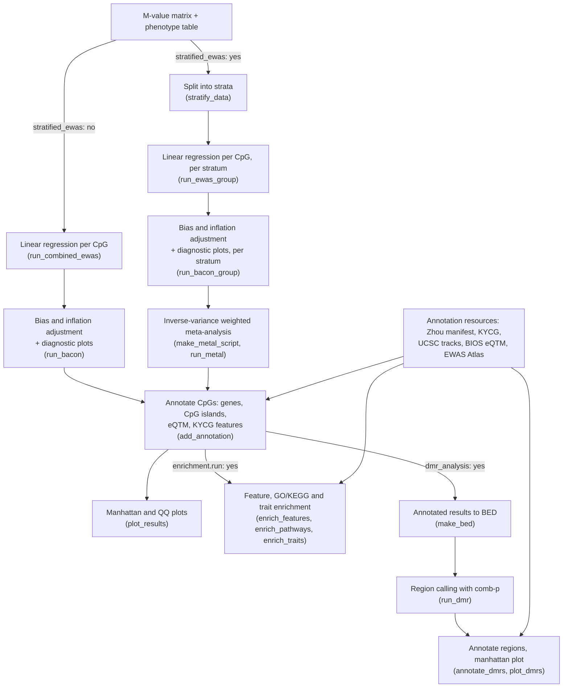

# Overview

---
This repository is a snakemake workflow for performing Epigenome-Wide Association Studies (EWAS) of methylation measured by an Illumina Infinium methylation array. It was developed and tested against the EPIC (850k) array. The annotation step is platform-agnostic — every array Zhou publishes (EPIC, EPICv2, MSA, HM450, HM27, Mammal40, MM285) shares one manifest schema and is selectable via `annotation.array_platform` — but only EPIC has been exercised end to end, so treat the others as untested. This workflow can perform a standard EWAS or a stratified EWAS based on the variables provided for stratification. In either the standard or stratified EWAS, a linear regression model is used where the outcome is the methylation value (Beta or M-values) and the trait/phenotype you want to perform association testing with is the main predictor. All other variables included in the phenotype dataframe will be added as covariates to the model.

If your main predictor is categorical (with 2 levels), the values must be dummy coded to numerics. All other categorical covariates can remain as characters. The R glm() function is unable to use unordered categorical data as the main predictor because it cannot determine which of the values to use as the reference. The pipeline has not yet been tested with a main predictor that has more than two categorical levels. Automatic handling of predictors that are categorical/character values will be added in the next major update.

Results from the linear regression analyses will be adjusted for bias and inflation using a Bayesian approach implemented by the [BACON](https://www.bioconductor.org/packages/release/bioc/html/bacon.html) R package. BACON >= 1.32.0 (Bioconductor 3.19) is required and pinned in `envs/ewas.yaml`: earlier versions lack the `globalSeed` and `parallelSeed` arguments this workflow relies on for reproducible Gibbs sampling. The ggplot2 diagnostic plots in `scripts/updated_bacon/modified_bacon_plots.R` are local modifications to the package, so the plots are created with ggplot instead of base R. It is strongly recommended to assess the performance of the bias and inflation adjustment by viewing the traces, posteriors, fit, and qq plots output at this step. Further details on how to assess the performance plots are provided below. If the EWAS was stratified, after adjustment for bias and inflation, the results from all the strata will be combined using an inverse-variance weighted meta-analysis approach with the command line tool [METAL](https://genome.sph.umich.edu/wiki/METAL_Documentation).

The final EWAS results are annotated from three sources: gene and promoter assignments from the [Wanding Zhou](https://zwdzwd.github.io/InfiniumAnnotation) Infinium manifest, CpG-island context derived from the UCSC `cpgIslandExt` track, and whole-blood *cis*-eQTM genes from BIOS. A manhattan and qq plot of the final EWAS results is also output. See [Annotation Resources](#annotation-resources) for what each contributes and how it is versioned, and [Annotated Results Columns](#annotated-results-columns) for the output file layout.

The significant CpG set is then assessed automatically for functional, pathway and trait enrichment — chromatin states and other [Know Your CpG (KYCG)](https://zhou-lab.github.io/kycg/) feature sets, GO and KEGG terms, and published EWAS Atlas trait associations — all tested against the CpGs actually analysed rather than the whole array. See [Functional Enrichment](#functional-enrichment).

This workflow can also perform differentially methylated region (DMR) analysis using the EWAS summary statistics. The DMR is conducted with the [comb-p](https://github.com/brentp/combined-pvalues) command-line tool. Parameters for performing the DMR can be modified in the config.yaml. 

## Workflow at a glance

Optional stages are labelled with the config setting that switches them on;
rule names are in parentheses.



Every run that executes at least one job also records its own command line and
configuration -- see [Run Provenance](#run-provenance). Rule-level graphs of the
complete workflow for both modes are in `data/example_dags/`.

# Dependencies

---

* Conda/Mamba
* Snakemake, version >= 9.3.3

# Using this Workflow

---

## Modifying the Configuration File

This workflow uses a configuration file, `config.yml`, to specify the paths for input and output files, what kind of EWAS to perform (standard or stratified), parallelization parameters, whether to run DMR, and whether to perform the functional analyses.

### *Input Files*

This workflow is intended to be used with phenotype and methylation data that has already been cleaned and has no missing/`NA` data. The first column of the phenotype data and the methylation data must be the sample IDs. Examples of what the phenotype and methylation data should look like can be found in the `data/` directory. Accepted input file types:

* regular delimited (.csv, .tsv, .txt, etc.)
  * file path or URL
  * can be `.gz` or `.bz2` compressed
* fast-storage (.fst):
  * file path

### *Output Files*

<a name="output-files"></a>

Everything is written under the `out_directory` set in the config file. In the
paths below, `<assoc>` is `association_variable` and `<stratum>` is one level of
`stratify_variables` (so a stratified run repeats those files once per stratum).

```
<out_directory>/
|
|-- provenance/                                  how this run was invoked
|   |-- runs.tsv                                 append-only index: run_id, times, status, command
|   `-- <run_id>/
|       |-- command.txt                          the exact command line
|       |-- config_snapshot.yml                  verbatim copy of the config file used
|       |-- config_resolved.yml                  config after --config overrides
|       `-- run_info.yml                         versions, git state, host, timings, status
|
|-- <assoc>_ewas_results.csv.gz                  STANDARD ONLY: raw per-CpG regression
|-- <assoc>_ewas_bacon_results.csv.gz            STANDARD ONLY: bias/inflation adjusted
|-- bacon_plots/                                 STANDARD ONLY: BACON diagnostics
|   |-- <assoc>_traces.jpg
|   |-- <assoc>_posteriors.jpg
|   |-- <assoc>_fit.jpg
|   `-- <assoc>_qqs.jpg
|
|-- <stratum>/                                   STRATIFIED ONLY: one directory per stratum
|   |-- <stratum>_pheno.fst                      temporary, removed when the stratum finishes
|   |-- <stratum>_mvals.fst                      temporary, removed when the stratum finishes
|   |-- <stratum>_<assoc>_ewas_results.csv.gz    raw per-CpG regression for this stratum
|   |-- <stratum>_<assoc>_ewas_bacon_results.csv.gz
|   `-- bacon_plots/
|       |-- <stratum>_<assoc>_traces.jpg
|       |-- <stratum>_<assoc>_posteriors.jpg
|       |-- <stratum>_<assoc>_fit.jpg
|       `-- <stratum>_<assoc>_qqs.jpg
|-- meta_analysis/
|   `-- <assoc>_metal_commands.sh                STRATIFIED ONLY: generated METAL script
|-- <assoc>_ewas_meta_analysis_results_1.txt     STRATIFIED ONLY: METAL output
|
|-- <assoc>_ewas_annotated_results.csv.gz        final results, annotated (both modes)
|-- <assoc>_ewas_manhattan_qq_plots.jpg          manhattan + QQ of the final results
|
|-- enrichment/                                  only when enrichment.run: "yes"
|   |-- <assoc>_enrichment_features.tsv          KYCG feature over-representation
|   |-- <assoc>_enrichment_pathways.tsv          GO and KEGG terms
|   `-- <assoc>_enrichment_traits.tsv            EWAS Atlas trait associations
|
|-- <assoc>_ewas_annotated_results.bed           only when dmr_analysis: "yes": comb-p input
`-- dmr/                                         only when dmr_analysis: "yes"
    |-- <assoc>_ewas.args.txt                    comb-p arguments used
    |-- <assoc>_ewas.acf.txt                     autocorrelation by distance lag
    |-- <assoc>_ewas.slk.bed.gz                  per-CpG p-values after Stouffer-Liptak-Kechris
    |-- <assoc>_ewas.fdr.bed.gz                  the above with Benjamini-Hochberg FDR
    |-- <assoc>_ewas.regions.bed.gz              called regions
    |-- <assoc>_ewas.regions-p.bed.gz            called regions with region-level p-values
    |-- <assoc>_ewas.manhattan.png               comb-p's own manhattan plot
    |-- <assoc>_dmr_annotated_results.tsv        regions annotated with genes and CpG islands
    `-- <assoc>_dmr_manhattan.jpg                manhattan plot of the annotated regions
```

A note on the DMR files: `run_dmr` declares six of comb-p's outputs as rule
outputs. comb-p writes some additional intermediates (for example
`<assoc>_ewas.regions-t.bed.gz`) that Snakemake does not track, so they are not
cleaned up or re-created on a rerun. Not all region files appear if no region
reaches significance.

Annotation resources are cached outside `out_directory`, under
`annotation.cache_dir` (default `resources/annotation/`) so they are downloaded
once and shared across runs. METAL is built once into `software/metal/`. See
[Annotation Resources](#annotation-resources).

#### What each stage produces

**EWAS** (`run_combined_ewas` / `stratify_data` + `run_ewas_group`)

* Raw per-CpG linear regression results: effect size, standard error, test
  statistic and p-value for the association variable, one row per CpG.
* A stratified run writes one of these per stratum, into `<stratum>/`. The
  per-stratum `.fst` phenotype and M-value subsets are marked `temp()`, so
  Snakemake deletes them once the stratum's results exist.

**BACON** (`run_bacon` / `run_bacon_group`)

* Bias- and inflation-adjusted results, adding `bacon.es`, `bacon.se`,
  `bacon.statistic`, `bacon.pval` and the genomic inflation factors `lambda`
  (before) and `b.lambda` (after).
* Four diagnostic plots per run or per stratum -- traces, posteriors, fit and
  QQ. Check these before trusting the adjustment; see
  [Interpretation of BACON Performance Plots](#interpretation-of-bacon-performance-plots).

**Meta-analysis** (`make_metal_script`, `run_metal`, stratified only)

* A generated METAL command script, kept so the meta-analysis is reproducible
  and inspectable.
* METAL's inverse-variance weighted results across strata: `MarkerName`,
  `Effect`, `StdErr`, `P-value` and `Direction`, the last giving one character
  per stratum so you can see whether strata agree in sign.

**Annotation** (`add_annotation`)

* The final results table: the EWAS or meta-analysis statistics with annotation
  columns joined on, sorted by p-value. This is the file to work from.
* Gene and transcript assignments, CpG-island context, whole-blood eQTM genes
  and KYCG feature columns. Every column is listed in
  [Annotated Results Columns](#annotated-results-columns).
* The rule reports the fraction of result CpGs it could annotate and stops if
  that falls below a floor, which is what catches a mismatch between
  `annotation.array_platform` and the array the M-values came from.

**Enrichment** (`enrich_features`, `enrich_pathways`, `enrich_traits`)

* Three tables testing the significant CpG set for over-representation of KYCG
  features, GO/KEGG terms and published EWAS Atlas traits, against the CpGs
  actually tested rather than the whole array. Details and caveats in
  [Functional Enrichment](#functional-enrichment).

**DMR** (`make_bed`, `run_dmr`, `annotate_dmrs`, `plot_dmrs`)

* A BED of the annotated results, which is comb-p's input.
* comb-p's intermediates: the arguments used, the autocorrelation function by
  distance lag, per-CpG p-values corrected for local correlation, and the same
  with FDR. The `.acf.txt` is worth a look -- it shows the distance over which
  neighbouring CpGs are correlated, which sets how regions get built.
* The called regions, with and without region-level p-values, plus comb-p's own
  manhattan plot.
* The final annotated region table, with genes and CpG-island context attached,
  and a manhattan plot of those regions.

**Provenance** (`onstart` / `onsuccess` / `onerror` handlers)

* A per-run record of the command and configuration that produced everything
  above. See [Run Provenance](#run-provenance).

### *Annotation Resources*

<a name="annotation-resources"></a>

Everything the workflow downloads for annotation is configured in the single
`annotation:` block of `config.yml` and cached under one root
(`annotation.cache_dir`, default `resources/annotation/`). The cache is
subdivided by source because each source is versioned differently:

```
resources/annotation/
  zhou/<array_platform>/<zhou_release>/   Zhou Infinium manifest + provenance
  ucsc/<genome_build>/<cache_tag>/        UCSC tracks + provenance
  eqtm/                                   BIOS eQTM and HGNC tables
```

Each fetch rule writes a small `*_manifest.tsv` beside the files it downloads,
recording the source URL, version and timestamp, so a results directory can be
traced back to the exact annotation used.

| Source | Supplies | Fetched by | Needed when |
|--------|----------|------------|-------------|
| Zhou Infinium manifest (`<platform>.<genome>.manifest.gencode.<release>.tsv.gz`) | `genesUniq`, `geneNames`, `transcriptTypes`, `transcriptIDs`, `distToTSS`, probe coordinates | `get_annotation_data` | always |
| UCSC `cpgIslandExt` | `CGI`, `CGIposition` (Island / N_Shore / S_Shore / N_Shelf / S_Shelf) | `fetch_cpg_island_cache` | always |
| BIOS *cis*-eQTM + HGNC | `BIOS_eQTM_genes` | `get_annotation_data`, `prep_bios_eqtm_annotation` | always |
| UCSC `refGene` + HGNC BigBed | DMR gene annotation | `fetch_dmr_annotation_cache` | only when `dmr_analysis: "yes"` |

#### Which settings matter

| Setting | Default | Notes |
|---------|---------|-------|
| `array_platform` | `EPIC` | **Must match the probe IDs in your M-value matrix.** EPIC, HM450, HM27 and Mammal40 use bare IDs (`cg00000029`); EPICv2 and MSA use design-suffixed IDs (`cg00000029_TC21`). All platforms share the same manifest columns, so a mismatch does not fail loudly on its own — `annotation.R` therefore reports the match rate and aborts below 50%. |
| `zhou_release` | `v8.1` | Git tag in `zhou-lab/InfiniumAnnotationData`. Use `main` to track the newest release; pin a tag for a reproducible run. |
| `gencode_release` | `v41` | Tied to `genome_build`: hg38 &rarr; `v41`, hg19 &rarr; `v26lift37`, mm10 &rarr; `vM25`, mm39 &rarr; `vM31`. |
| `cache_tag` | `latest` | UCSC track cache version. Set an ISO date (e.g. `2026-06-08`) for a manuscript run so the cache path records when the tracks were pulled. |

The remaining keys are base URLs and rarely need changing. The whole block may
be omitted; `helper_fxns.ConfigWizard` supplies the same values as defaults.

#### Notes on the annotation sources

Zhou's resources moved off `zhouserver.research.chop.edu` and were reorganised
around a versioned "coherent" release (currently v8.1). Two consequences matter
here. First, GENCODE v41 no longer carries the `CGI` and `CGIposition` columns
that v36 supplied, so island context is recomputed from the UCSC track — which
is where Zhou's own CGI annotation was derived from. Re-deriving reproduces the
KYCG v8.1 CGI bitset for 99.90% of probes and the legacy island coordinate
strings for 99.99%, and the residual differences are probes the frozen legacy
table missed. Shores extend 2 kb from an island and shelves a further 2 kb, the
standard definitions; they are arguments to `annotation.R` rather than config
settings, since there is no reason to vary them outside a sensitivity check.

Second, the old `EPIC.hg38.commonsnp.tsv.gz` SNP annotation has no successor in
v8.1 and is no longer used. The v8.1 `snp.tsv.gz` is not a replacement — it is
the Infinium-I colour-channel/`formatVCF` table, with an rsID on only 0.9% of
its rows and no allele frequencies. Probes affected by common variants are
expected to be masked before the M-value matrix reaches this workflow.

#### Network access

The fetch rules require outbound access to `github.com`, `api.github.com`,
`ngdc.cncb.ac.cn`,
`hgdownload.soe.ucsc.edu`, `molgenis26.gcc.rug.nl` and
`storage.googleapis.com`. All downloads are cached, so only the first run needs
them.

### *Annotated Results Columns*

<a name="annotated-results-columns"></a>

`<out_directory>/<association_variable>_ewas_annotated_results<out_type>`, one row
per tested CpG, sorted by adjusted p-value.

The identifier and statistic columns differ by EWAS mode: an unstratified run
keys on `cpgid` with BACON columns, a stratified run keys on `MarkerName` with
METAL columns.

| Column | Source | Meaning |
|--------|--------|---------|
| `cpgid` *(unstratified)* | EWAS | Probe identifier. |
| `MarkerName` *(stratified)* | METAL | Probe identifier. |
| `bacon.es`, `bacon.se`, `bacon.statistic`, `bacon.pval` *(unstratified)* | BACON | Bias- and inflation-adjusted effect size, standard error, test statistic and p-value. |
| `lambda`, `b.lambda` *(unstratified)* | QCEWAS | Genomic inflation before and after BACON adjustment. |
| `Effect`, `StdErr`, `P-value`, `Direction` *(stratified)* | METAL | Inverse-variance weighted meta-analysis across strata. `Direction` gives one character per stratum. |
| `CpG_chrm`, `CpG_beg`, `CpG_end` | Zhou manifest | Probe coordinates on `genome_build`, 0-based half-open. |
| `probe_strand` | Zhou manifest | Strand the probe interrogates. |
| `genesUniq` | Zhou manifest | Unique gene symbols the probe maps to, semicolon separated. |
| `geneNames` | Zhou manifest | Gene symbol per overlapping transcript, aligned with `transcriptIDs`. |
| `transcriptTypes` | Zhou manifest | Biotype per transcript (`protein_coding`, `lncRNA`, ...). |
| `transcriptIDs` | Zhou manifest | Ensembl transcript identifiers. |
| `distToTSS` | Zhou manifest | Signed distance in bp to each transcript's TSS; negative is upstream. |
| `CGI` | UCSC `cpgIslandExt` | Coordinates of the nearest CpG island, e.g. `CGI:chr1:28735-29737`. Empty in open sea. |
| `CGIposition` | derived | `Island`, `N_Shore`, `S_Shore`, `N_Shelf`, `S_Shelf`, or empty for open sea. Shores span 2 kb from the island, shelves a further 2 kb. |
| `BIOS_eQTM_genes` | BIOS | Genes whose expression correlates with methylation at this CpG in whole blood (FDR 0.05), HGNC-resolved. |
| `chromHMM_state` | KYCG | Roadmap/ENCODE 18-state chromatin state: `TssA`, `TssFlnk`, `TssFlnkU`, `TssFlnkD`, `Tx`, `TxWk`, `EnhG1`, `EnhG2`, `EnhA1`, `EnhA2`, `EnhWk`, `ZNF/Rpts`, `Het`, `TssBiv`, `EnhBiv`, `ReprPC`, `ReprPCWk`, `Quies`. |
| `PMD` | KYCG | `commonPMD` (partially methylated domain) or `commonHMD` (highly methylated domain). |
| `AB_compartment` | KYCG | Hi-C compartment: `A1`, `A2` (open/active) or `B1`-`B4` (closed/inactive). |
| `repeat_class` | KYCG | RepeatMasker class: `LINE`, `SINE`, `LTR`, `Satellite`, `Simple_repeat` and others. Semicolon separated where a probe falls in more than one. |
| `imprinting_DMR` | KYCG | `ImprintingDMR` when the probe sits in a known imprinting control region. |
| `CTCF_binding` | KYCG | `CTCFbind` when the probe overlaps a CTCF binding site. |
| `ENCODE_blacklist` | KYCG | `Blacklist` when the probe falls in an ENCODE blacklist region. Treat such hits with suspicion. |

KYCG columns appear only when the configured `array_platform` publishes those
sets; a missing set is skipped rather than erroring. An empty value means the
probe is not annotated for that feature, not that the feature is absent.

SNP annotation is deliberately not included; see
[Notes on the annotation sources](#notes-on-the-annotation-sources).

### *Functional Enrichment*

<a name="functional-enrichment"></a>

Three independent tests of the significant CpG set, controlled by the
`enrichment:` block in `config.yml` and written to
`<out_directory>/enrichment/`. Set `run: "no"` to skip all three.

**The background is the set of CpGs actually tested, never the full array.**
Probes are dropped before an EWAS for mapping quality, masking and QC, and
those exclusions are not uniform across the genome. Testing against the whole
manifest would score that removal pattern as enrichment. The counts here will
therefore not match tools that default to the array as the universe.

A test that cannot run writes an empty table naming the reason in its log
rather than failing the workflow.

| Setting | Default | Notes |
|---------|---------|-------|
| `run` | `yes` | `no` skips all three rules. |
| `significance` | `fdr` | `fdr` (Benjamini-Hochberg), `bonferroni`, or `nominal` for the raw p-value. |
| `threshold` | `0.05` | Cutoff on the adjusted (or raw) p-value that defines the significant set. |
| `min_set_size` | `20` | Features, terms and traits with fewer probes in the background are not tested. |
| `ewas_atlas_url` | NGDC | EWAS Atlas association table, about 100 MB, cached on first use. |

#### `<assoc>_enrichment_features.tsv`

The significant set against the KYCG knowledgebases from the same pinned v8.1
release the annotation uses: chromatin states, 82 histone marks, 1188
transcription-factor binding sets, repeats, PMDs, A/B compartments, metagene
position and CpG islands.

Implemented with `yame`: the query is packed as a format-6 record carrying two
bits per probe, one for the universe and one for the set, so the restricted
background is applied inside the overlap counting. `yame summary` then reports
the 2x2 per feature and the hypergeometric p-value and FDR are computed in R.

Columns: `knowledgebase`, `feature`, `n_universe`, `n_significant`,
`n_in_feature`, `n_overlap`, `expected`, `fold_enrichment`,
`log2_odds_ratio`, `p_value`, `fdr`.

Reading it: transcription-factor sets are heavily correlated with one another
and with active promoters, so a promoter-shifted result will light up hundreds
of TFBS rows at once. Treat the knowledgebase as the unit of interpretation,
not the individual row, and look at `fold_enrichment` alongside the FDR.

#### `<assoc>_enrichment_pathways.tsv`

GO and KEGG via `missMethyl::gometh`, which corrects for the number of probes
per gene. This matters: a gene covered by 80 probes is far likelier to pick up
a significant CpG than one covered by 3, and an uncorrected gene-set test
reports that coverage as biology.

The cost is that missMethyl maps probes with Illumina's own annotation
packages, so **only 450K, EPIC and EPICv2 are supported**. On any other
`array_platform` this rule writes an empty table and says so; feature and trait
enrichment still run.

Columns: `collection`, `term_id`, `term`, `ontology`, `n_genes_in_term`,
`n_significant_genes`, `p_value`, `fdr`.

#### `<assoc>_enrichment_traits.tsv`

Over-representation of published trait associations from the
[EWAS Atlas](https://ngdc.cncb.ac.cn/ewas/atlas), replacing looking hits up in
the web interface by hand.

Columns: `trait`, `n_universe`, `n_significant`, `n_trait_probes`,
`n_overlap`, `expected`, `fold_enrichment`, `p_value`, `fdr`, `n_studies`,
`pmids`, `overlapping_probes`.

Two caveats. The Atlas is a catalogue of what has been published, so its
coverage reflects study volume -- smoking, ageing and sex dominate it, and an
overlap with those partly reflects how often they have been measured. And each
trait's probe list is restricted here to probes in your background, so counts
will not match the Atlas website, which reports across all arrays at once.

The Atlas is keyed on bare `cg` identifiers, so an EPICv2 or MSA run that keeps
the design suffix will not match; the rule reports this rather than returning
an empty result silently.

### *Run Provenance*

<a name="run-provenance"></a>

Every run that executes at least one job records how it was invoked, under
`<out_directory>/provenance/<run_id>/`, where `run_id` is the UTC-offset start
time (`20260914T135105`):

| File | Contents |
|------|----------|
| `command.txt` | The exact command line, shell-quoted so it can be pasted back, followed by one argument per line for long invocations. |
| `config_snapshot.yml` | Byte-for-byte copy of each configuration file used. A second and subsequent file is saved as `config_snapshot.2.<name>`. |
| `config_resolved.yml` | The merged configuration Snakemake actually ran with, including any `--config` overrides. This, not the snapshot, is what the workflow saw. |
| `run_info.yml` | Snakemake and Python versions, workflow git commit/branch/dirty state, host, user, working directory, start and end time, duration, and final status. |

`provenance/runs.tsv` is an append-only index across runs -- `run_id`,
`started`, `ended`, `status`, `command` -- so you can see at a glance which
invocation produced a given results directory and whether it finished.

Nothing needs configuring; the records follow `out_directory`.

#### Why this is a handler and not a rule

It is implemented with Snakemake's `onstart`, `onsuccess` and `onerror`
handlers rather than as a workflow rule, because a rule cannot do the job
correctly:

1. A rule's output is cached. On the second invocation the file is already present and up to date, the rule does not re-run, and the recorded command stays stale from the first run -- exactly backwards for a provenance record.
2. Making the output unique per run means putting a timestamp in the path, but the Snakefile is re-parsed by every job subprocess. Each would compute a different timestamp and the target would stop matching.
3. A rule body executes in a job subprocess, where `sys.argv` is Snakemake's own re-invocation (`--target-jobs ... --mode subprocess`), not the command you typed. `onstart` runs in the main process, where `sys.argv` is the real command line.

One consequence to be aware of: the handlers fire only when Snakemake actually
executes jobs. A dry run, or a run reporting "Nothing to be done", writes no
record. That is intended -- no results were produced, and the record from the
run that did produce them is already on disk.

Provenance failures never stop an analysis: a problem writing the record prints
a `[provenance] WARNING` and the run continues.

### *Parallelization Parameters*

The rule 'ewas' first chunks the methylation dataset into sets of CpGs where the length of each set is specified by the parameter `chunks` in the config file (default of 1000 CpGs if a number is not provided). Then, linear regressions are run for each chunk and the results combined back into one dataframe once all chunks have been processed. Run sequentially, this step could take several hours. However, each chunk can be processed in parallel to reduce the total computation time.

The main step of the EWAS utilizes the [BiocParallel](https://bioconductor.org/packages/release/bioc/html/BiocParallel.html) R package to perform the linear regressions in parallel. You can specify the type of parallelization to be performed at this step in the config file. The options include: sequential, multisession (threads), multicore, or cluster. You must also specify the number of workers that you want to be used for the parallelization in the `workers` parameter of the config file. For more details on the different types of parallelization you can reference the BiocParallel documentation.

If you are performing a stratified analysis, you can have each strata processed in parallel using the `-j` parameter in the snakemake command. For resource allocation, keep in mind that each EWAS performed will use the number of workers specified in the config file, so you will need n=(workers x jobs) resources available. For example, if you use multicore parallelization with 2 workers and `-j 2` in the snakemake command, you will need to have 4 cores available to run the analysis.

### *DMR Parameters*

If you do not want DMR results, you can simply change the `dmr_analysis` parameter to "no".

Note that `genome_build` is not a DMR-only setting: it selects both the UCSC tracks and the Zhou manifest, so it applies whether or not DMR analysis is run.

| Parameter | Default value | Description                                                          |
|-----------|---------------|----------------------------------------------------------------------|
|min_pvalue | 1e-04         | P-value threshold for beginning a region                             |
| window_size | 200           | Maximum distance to search for another CpG < min_pvalue              |
| region_filter | 0.05          | max adjusted region-level p-value to be reported                     |

## Dry Run & DAG

Before running the full pipeline, you can perform a dry run to make sure that your configuration file is set up correctly. 

```shell
snakemake --dry-run
```
It can also be helpful to export a Directed Acyclic Graph (DAG) of the workflow, especially in the case of a stratified EWAS so that you can check that the data is subset how you expect it to be. If not already installed, you will need Graphviz to create a png of the DAG (`conda install graphviz`).

```shell
snakemake --dag --rule plot_results | dot -Tpng > dag.png
```

Examples of DAGs for a standard and stratified EWAS can be found in
`data/example_dags`. That directory also holds rule-level graphs, which are
much easier to read than the job DAG on a stratified run because they show one
node per rule rather than one per job:

```shell
snakemake --rulegraph | dot -Tpng > rulegraph.png
```

* `data/example_dags/standard_ewas_rulegraph.png`
* `data/example_dags/stratified_ewas_rulegraph.png`

## Run EWAS

Once you have modified the `config.yml` file to match your projects specifications and computational resources you are ready to run the EWAS. The first time you run the pipeline it may take a while to begin as snakemake will need to download the annotation files and build the conda environment for performing the EWAS. These steps will be cached and will not need to be performed again in subsequent runs. 

**Standard (non-stratified) or Stratified EWAS**:

```shell
snakemake -j <n_jobs>
```

## Track Progress

In the `run_ewas` step, a progress reporting bar is generated and output to stdout which will show percent finished and the estimated time to completion. For a standard EWAS, nothing needs to be done to view the progress bar in your terminal. 

For a stratified EWAS, once the `run_ewas` step has been reached, a`/log` directory will be created with log files for the progress of each strata. To view the progress bar of a specific stratum in the terminal, you can open a new terminal, navigate to the directory you are running the snakemake workflow,then run:

```shell
tail -F log/<stratum>_ewas.log
```

<a name="interpretation-of-bacon-performance-plots"></a>

# Interpretation of BACON Performance Plots

There are four plot types output from the bias- and inflation- adjustment analysis step to assess the performance of the Gibbs Sampler algorithm including:

* **Traces**: traces-plots of all estimates (sigma, p, mu)
* **Posteriors**: scatter plot of the Gibbs Sampler posterior probabilities for inflation (sigma.0) and proportion of null features (p.0). Elliptical curves correspond to 75%, 90%, and 95% probability regions.
* **Fit**: fit of the three component mixture over-layed on a histogram of z-scores. The black curve shows the overall fit, red shows the fit of the null distribution, and the blue and green curves show the alternatives.
* **QQ**: qq plots before and after adjustment with BACON.

Below are examples of what these plots should look like when the Gibbs Sampler algorithm has performed well. Poor performance can be an indication that there is something problematic with the underlying data; perhaps there are extreme outliers that were not removed prior to analysis, or maybe there is a confounding factor that isn't properly accounted for in the EWAS model. If the plots look like those shown below, then the EWAS results are likely to be reliable. If the plots look different, then further investigation is needed to determine the cause of the poor performance.

### Traces Plot

The traces plot shows the evolution of each parameter over time during the Gibbs Sampler algorithm. The algorithm begins with the provided priors and iterates until it converges on a set of estimates for each parameter. If the initial prior for a parameter is not close to the final estimate, there will be a period of divergence before convergence occurs. This can be seen in the traces plot as a sharp change in the value of the parameter at the beginning of the algorithm and then a gradual approach towards the final estimate. If the initial prior is close to the final estimate, then the algorithm will converge quickly and the plot will appear like a 'hairy caterpillar' (not a smooth line).


In the above plot, you can see that the traces converged on their respective estimates after a period of divergence for all parameters except mu.1. The initial prior estimate for mu.1 was close to the final estimate (the range of estimates is relatively small), so the algorithm converged quickly and resulted in a 'hairy caterpillar' plot.

### Posteriors Plot

The posteriors plot is a scatterplot of the estimated posterior values of the parameters mu.0 and p.0. The distribution of posterior values should be normally distributed for each parameter, thus the scatterplot should appear like a dense cloud of points. A sparse cloud indicates the algorithm was not able to converge on an estimate quickly (if at all).


### Fit Plot

The fit plot shows the distribution of the z-scores for each observation in the dataset as a histogram. Overlayed is a black density line of the overall fit of the model estimated by the Gibb's Sampling algorithm based on three components: a null component (red density line) and two alternate components (blue and green density lines). In the case of an EWAS:

* **Null Component**: The background noise or null hypothesis that a CpG is not significantly associated with the phenotype.
* **Alternate Components**: The alternative hypotheses; the CpG is significantly associated with the phenotype in a negative or positive way.

If the estimated distribution (black line) is vastly different from the observed distribution, then the model may be mis-specified and/or the Gibb's Sampling algorithm did not converge on an estimate. If the estimated distribution is similar to the observed distribution, then the model is likely correctly specified.


### QQ Plots

QQ plots are a scatterplot of the observed p-values against the expected p-values under the null hypothesis. The diagonal line represents the perfect fit between the observed and expected values. In the case of an EWAS, the points should follow the diagonal line relatively closely, with a spike of points at the end of the plot which represent the significant associations. Deviation from the diagonal line prior to the spike (if there is one) indicates there is global bias and/or inflation of the observed data. After adjustment  with BACON ('corrected' panel), the points prior to the spike should follow the diagonal line more closely. If there is still evidence of global bias and/or inflation after adjustment, then the model may be mis-specified.


Often, the BACON adjustment does not drastically change the observed p-values compared with the unadjusted p-values and it can be difficult to assess visually whether the BACON adjustment 'worked'. The effect of the adjustment can more easily be discerned with a metric often referred to as the 'genomic inflation factor', or lambda (λ), which is a calculation of the deviation of the observed p-values from the expected p-values. A value of 1 indicates no inflation, while values greater than 1 indicate inflation and less than 1 indicate deflation. In general, the BACON adjustment should bring the λ closer to 1. The unadjusted λ ('lambda') and BACON-adjusted ('b-lambda') values can be found in the output results file ending in 'ewas_bacon_results'.

